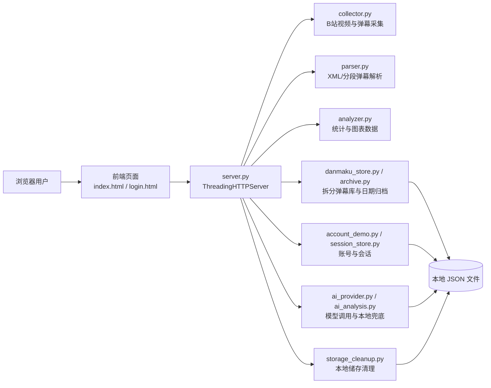
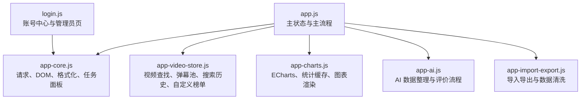
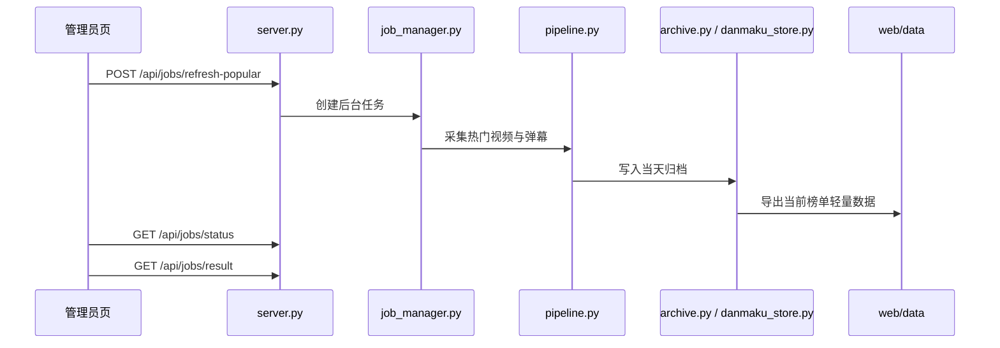
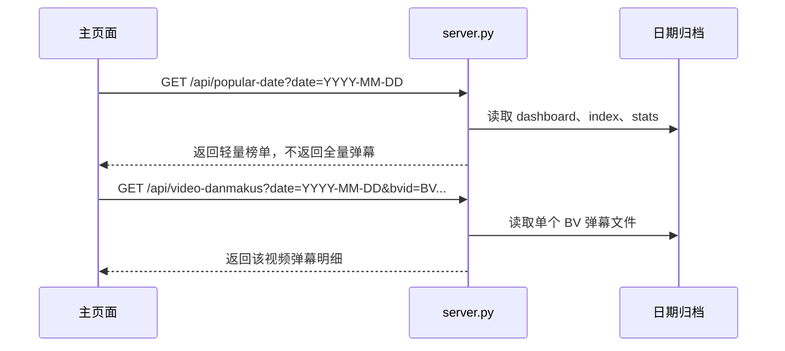
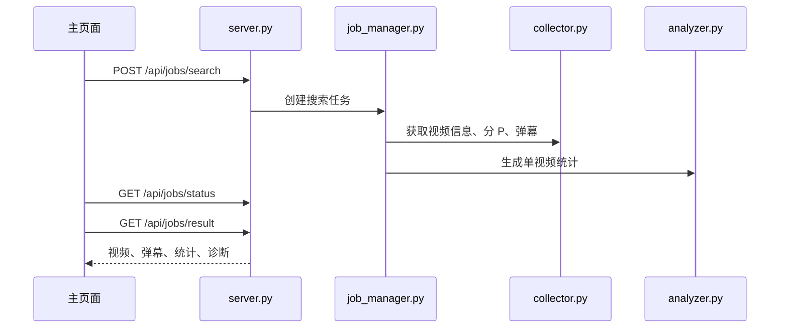
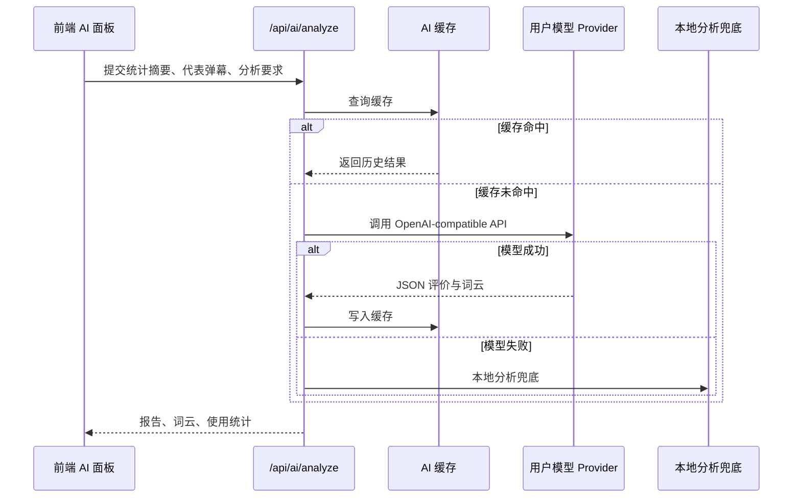
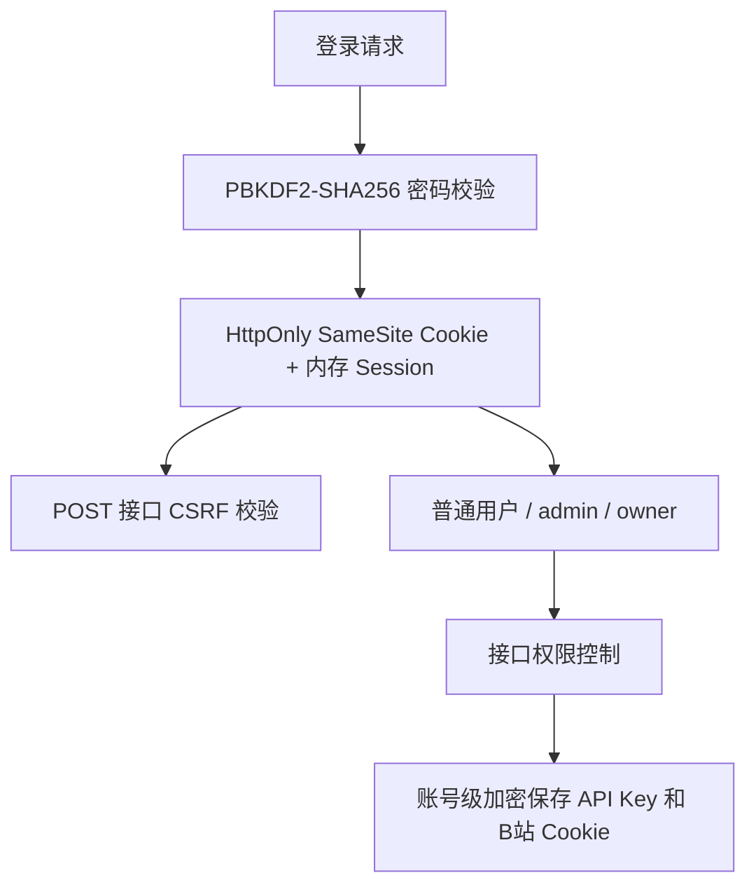

# 架构文档

## 总体架构

项目采用本地前后端一体的轻量架构。后端使用 Python 本地 HTTP 服务提供静态页面和 JSON API，前端使用 HTML、CSS、JavaScript 和 ECharts 渲染交互式分析页面。数据默认以 JSON 文件储存在本地目录，AI Key、B 站 Cookie 等敏感配置使用账号级本机加密保存。

## 分层说明

| 层级 | 主要文件 | 职责 |
| --- | --- | --- |
| 展示层 | `web/index.html`、`web/login.html`、CSS | 页面结构、视觉样式、用户交互入口 |
| 前端业务层 | `web/js/app.js`、`app-core.js`、`app-video-store.js`、`app-charts.js`、`app-ai.js`、`app-import-export.js` | 榜单、搜索、图表、对比、AI、导入导出和状态管理 |
| API 层 | `server.py` | 静态资源、JSON API、Session、CSRF、任务创建、权限校验 |
| 采集解析层 | `collector.py`、`parser.py`、`pipeline.py` | B 站视频信息、弹幕下载、解析、导出 |
| 分析层 | `analyzer.py`、`query.py`、`filter.py` | 词频、时间分布、长度分布、用户贡献榜、屏蔽词过滤 |
| 储存层 | `danmaku_store.py`、`archive.py`、`storage.py`、`storage_cleanup.py` | JSON 拆分储存、日期归档、原子写入、空间清理 |
| 账号安全层 | `account_demo.py`、`session_store.py`、`secure_provider_store.py`、`secure_bili_cookie_store.py`、`access_control.py` | 账号、密码、权限、会话、敏感配置加密 |
| AI 层 | `ai_provider.py`、`ai_analysis.py`、`ai_usage.py` | OpenAI-compatible Provider、本地分析、缓存、使用统计 |
| 数据库预备层 | `src/db/*`、`database/mysql/001_schema.sql` | MySQL 配置、建表、迁移、健康检查和文件导出 |

## 前端模块结构

前端保留集中状态，原因是视频可能同时存在于热门榜单、搜索历史、自定义榜单和对比列表中。统一的 `findVideo()`、`getDanmakusForVideo()` 和按需加载逻辑可以避免各模块重复维护视频和弹幕索引。

## 后端核心流程

### 热门榜单刷新

输出结果包括 `dashboard.json`、`danmaku_index.json`、`video_stats.json` 和每个视频独立的 `danmakus/<BVID>.json`。

### 热门日期切换与单视频弹幕加载

这个流程是当前性能优化的核心：榜单切换只读小文件，点击视频时才加载大文件。

### BV 搜索

搜索结果进入前端搜索历史库。历史库最多保留 15 个未固定视频，已加入自定义榜单或对比的视频不会被自动释放。

### AI 分析

## API 分组

| 分组 | 代表接口 | 说明 |
| --- | --- | --- |
| 账号 | `/api/account/login`、`/api/account/session`、`/api/account/logout` | 登录、会话、退出 |
| 账号配置 | `/api/account/provider`、`/api/account/bili-cookie`、`/api/account/block-words` | 模型配置、B 站 Cookie、个人屏蔽词 |
| 热门榜单 | `/api/popular-dates`、`/api/popular-date`、`/api/video-danmakus` | 日期、轻量榜单、单视频弹幕 |
| 后台任务 | `/api/jobs/search`、`/api/jobs/refresh-popular`、`/api/jobs/status`、`/api/jobs/result` | BV 搜索、热门刷新和进度 |
| AI | `/api/ai/analyze` | 当前视频和对比 AI 评价 |
| 管理员 | `/api/admin/status`、`/api/admin/users`、`/api/admin/ai-cache`、`/api/admin/storage-usage`、`/api/admin/storage-cleanup` | 状态、用户、缓存和储存清理 |

## 安全与权限架构

关键设计：

- 登录态由服务端 Session 维护，前端不保存密码或账号状态。
- Cookie 使用 `HttpOnly` 和 `SameSite=Lax`。
- 重要 POST 接口检查 CSRF Token。
- 管理员和 owner 权限分离，owner 是唯一可以维护管理员权限的角色。
- API Key 和 B 站 Cookie 不写入普通账号文件、不进入前端、不写入 README。
- 自定义模型 Base URL 限制 HTTPS，并阻止 localhost、内网和保留地址。

## 性能架构

项目针对本地运行和大弹幕文件做了几项优化：

- 后端使用 `ThreadingHTTPServer`，长任务不阻塞所有请求。
- 热门榜单刷新和 BV 搜索使用后台任务。
- 热门榜单弹幕按日期和视频拆成独立 JSON。
- 日期切换只加载榜单快照、弹幕索引和单视频统计。
- 前端搜索历史最多保留 15 个未固定视频。
- 图表统计使用缓存，弹幕池或屏蔽词变化时主动失效。
- AI 分析使用缓存和本地兜底，减少重复请求和失败影响。
- 服务启动自动做保守储存清理，管理员页支持预览和手动清理。

## 测试与质量

现有测试覆盖采集、解析、过滤、分析、归档、管道、任务、账号、权限、AI、本地加密储存、MySQL 准备工具和 HTTP smoke 测试。最近一次完整验证结果为 `140 passed`。

HTTP smoke 测试重点验证：

- 静态页面安全响应头。
- 登录 Cookie。
- CSRF 拦截。
- 普通用户访问管理员接口被拒绝。

## 后续架构演进

当前项目已经具备数据库迁移入口。建议后续演进顺序：

1. 将账号和 Session 从文件/内存迁移到 MySQL。
2. 将热门榜单、视频基础信息和单视频统计迁移到 MySQL。
3. 将任务状态从内存迁移到 `jobs` 和 `job_events`。
4. 弹幕明细可以继续文件化，也可以按 `bvid/cid/date` 进入数据库或对象储存。
5. AI 缓存和使用统计迁移到数据库，便于查询和审计。
